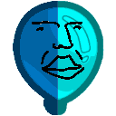

<h1 align="center">

BloonFactoryMod
</h1>

# How to use

## Selector Menu
The Bloon Editor is accessed through the main menu on the left. This is where you can make your own bloons. You can import or create a bloon in here and when you are ready to edit a bloon, you just need to click the edit button. You can also export your bloons from here. When you create or import a bloon you must restart the game before it will be spawnable.

## Actual Editor
In the editor there are 4 different tabs allowing you to edit 4 different aspects of the bloon. 

- Visuals
This is where you can change how the bloon looks by changing the color. You can also add decals (sorta like stickers) to the bloon, you can change the position and color of these decals. 

- Stats
This is where you can edit the base stats of the bloon such as health, speed, and name. You can also select properties such as camo, lead, purple, ect. to add to your bloon. Along with these this is where you add the bloons child bloons. These are the bloons that the bloon spawns when it pops.

- Behaviors
This is the most complicated part of the editor. This is where you add different behaviors that change how the bloon functions. There are 3 types of behaviors, triggers, actions, and standard behaviors. Triggers link up to actions and activate them when a certain thing happens, like a tower getting sold, or getting damaged. Actions are activated by triggers, these are things like spawning bloons, or stunning towers. Lastly, standard behaviors are behaviors that are always active, like damage reduction or giving lives on pop.

- Spawning
This is where you can set how the bloon spawns in a match. You can add a single round group, where you can set the round, how many bloons spawn, and the spacing between them. You can also add a multi round group where the bloons will spawn each round between the start and end round with the desired settings. 

This is my beautiful guide on how to make bloon. Yippee!

If you would like to share your bloons or ask questions you can on my discord! https://discord.gg/3nKPfw6mxt

